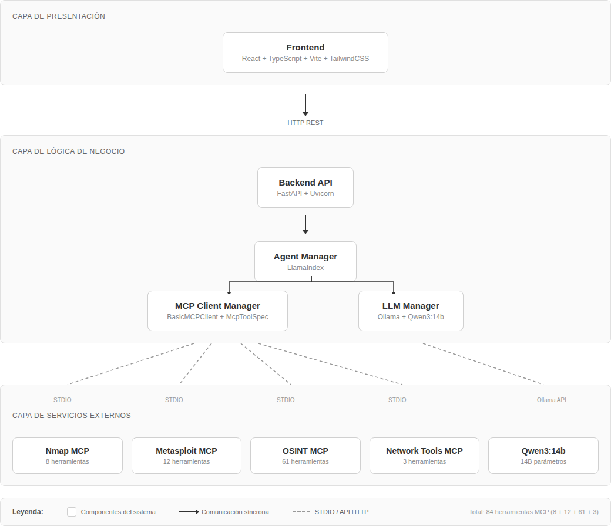
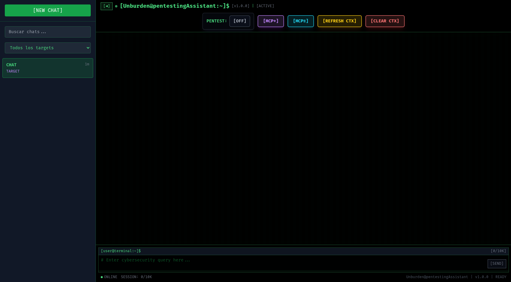
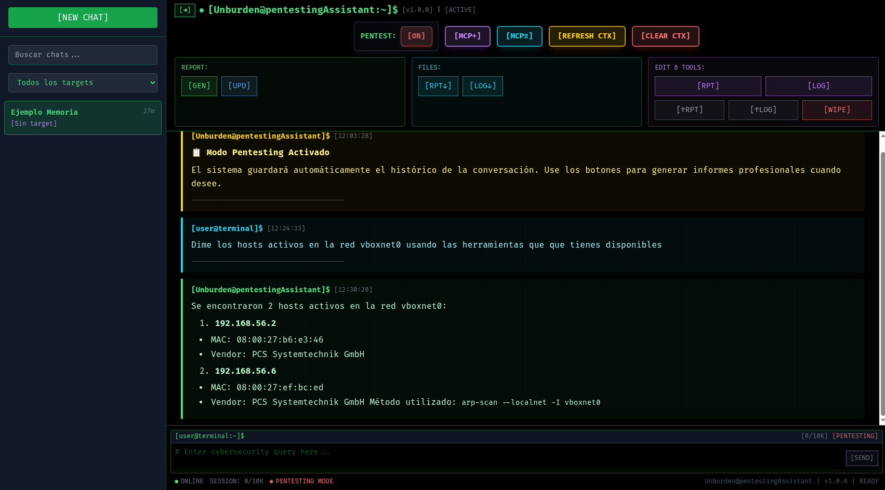

<div align="center">


**Unburden – Automated Pentesting Platform using an LLM and MCP Servers**

*Autonomous penetration testing • Network reconnaissance • OSINT • Exploit execution*


</div>

---

## Overview

**Unburden** is an Automated Pentesting Platform using an LLM and MCP Servers that orchestrates workflows through natural language. Instead of manually running tools like Nmap, Metasploit, or OSINT utilities, you describe what you want in plain language — the agent autonomously selects tools, executes commands, and presents structured results.

It integrates **84 security tools** across 4 MCP (Model Context Protocol) servers, powered by a local LLM (Qwen3:14B via Ollama) and the LlamaIndex agent framework.

<div align="center">



</div>

## Features

### 🔍 Network
- **Host discovery** — ARP scan, ping, ifconfig
- **Port scanning** — Full Nmap integration with 8 tools (SYN, TCP, UDP, version detection, OS fingerprinting)
- **Service identification** — Automated service and version detection

### 🛡️ Exploitation
- **Metasploit Framework** — 12 tools for exploit search, configuration, execution, and session management
- **Reverse shells** — Automated payload generation with Meterpreter support
- **Session management** — Interactive session control, command execution, and file operations

### 🌐 OSINT
- **61 OSINT tools** — Domain lookups, email harvesting, social media profiling, data breach searches
- **Automated intelligence gathering** — Structured output from multiple sources

### 📊 Reporting
- **Automated report generation** — Pentesting findings compiled into Markdown reports
- **Chat history** — Full conversation persistence with search, export, and import
- **Log management** — Download and review raw tool output

## Screenshots

<div align="center">

| Main Interface | Pentesting Mode |
|---|---|
|  |  |



</div>

## Architecture

Unburden follows a **three-layer architecture**:

```
┌─────────────────────────────────────────────┐
│  Presentation Layer                         │
│  React + TypeScript + Vite + TailwindCSS    │
├──────────────────┬──────────────────────────┤
│                  │ HTTP REST                │
├──────────────────┴──────────────────────────┤
│  Business Logic Layer                       │
│  FastAPI + Uvicorn                          │
│  ├── Agent Manager (LlamaIndex)             │
│  ├── MCP Client Manager                     │
│  └── LLM Manager (Ollama + Qwen3:14B)      │
├─────────────────────────────────────────────┤
│  External Services Layer                    │
│  ├── Nmap MCP Server      (8 tools)         │
│  ├── Metasploit MCP Server (12 tools)       │
│  ├── OSINT MCP Server     (61 tools)        │
│  ├── Network MCP Server    (3 tools)        │
│  └── Ollama API           (Qwen3:14B)       │
└─────────────────────────────────────────────┘
```

**Key technologies:**

| Component | Technology |
|---|---|
| Frontend | React 18, TypeScript, Vite, TailwindCSS |
| Backend API | FastAPI 0.116, Uvicorn, Python 3.11+ |
| AI Agent | LlamaIndex 0.13 (AgentWorkflow) |
| LLM | Qwen3:14B via Ollama (local inference) |
| Tool Protocol | Model Context Protocol (MCP) 1.12 |
| Exploitation | Metasploit Framework (pymetasploit3) |
| Scanning | Nmap (CLI wrapper) |

## Prerequisites

- **Linux** (tested on Kali Linux / Ubuntu)
- **Python 3.11+**
- **Node.js 18+** and npm
- **Ollama** with `qwen3:14b` model pulled
- **Metasploit Framework** (`msfrpcd`)
- **Nmap** installed system-wide

## Installation

### 1. Clone the repository

```bash
git clone https://github.com/your-org/Unburden.git
cd Unburden
```

### 2. Set up Python environment

```bash
python3 -m venv .venv
source .venv/bin/activate
pip install -r requirements.txt
```

### 3. Set up the frontend

```bash
cd src/frontend
npm install
npm run build
cd ../..
```

### 4. Pull the LLM model

```bash
ollama pull qwen3:14b
```

### 5. Configure environment variables

```bash
cp src/frontend/.env.example src/frontend/.env
```

Edit `src/frontend/.env` if deploying remotely (default works for `localhost`).

## Usage

### Quick Start

```bash
./Unburden.sh
```

This will:
1. Activate the Python virtual environment
2. Start `msfrpcd` (Metasploit RPC daemon)
3. Launch the application server on **port 7777**

### Access Points

| URL | Description |
|---|---|
| `http://localhost:7777/app` | Web interface |
| `http://localhost:7777/docs` | API documentation (Swagger) |
| `http://localhost:7777/health` | Health check endpoint |

### Example Workflow

1. **Create a new chat** → Click `[NEW CHAT]`
2. **Enable pentesting mode** → Click `[PENTEST: OFF]` to toggle to `[ON]`
3. **Set a target** → Enter the target IP when prompted
4. **Ask in natural language**:
   ```
   Discover active hosts on the vboxnet0 network
   ```
5. The agent will autonomously select the appropriate tool (e.g., `arp_scan`), execute it, and return structured results
6. **Generate a report** → Click `[GEN]` to compile findings

## Project Structure

```
Unburden/
├── Unburden.sh                 # Launch script
├── requirements.txt            # Python dependencies
├── README.md                   # Project documentation
├── assets/                     # Static assets
├── src/
│   ├── Unburden.py             # Main entry point
│   ├── backend/
│   │   ├── main.py             # FastAPI application setup
│   │   ├── agent/              # LlamaIndex agent manager
│   │   ├── chat/               # Chat history & session management
│   │   ├── config/             # Backend configuration
│   │   ├── mcp/                # MCP client & LLM manager
│   │   ├── models/             # Pydantic schemas
│   │   ├── reports/            # Report generation
│   │   ├── routes/             # FastAPI route handlers
│   │   └── utils/              # Shared utilities
│   └── frontend/
│       ├── src/                # React components
│       ├── package.json        # Frontend dependencies
│       └── vite.config.ts      # Build configuration
├── mcp_servers/
│   ├── config/                 # MCP server registry
│   └── servers/
│       ├── metasploit/         # Metasploit MCP server (12 tools)
│       ├── nmap/               # Nmap MCP server (8 tools)
│       ├── osint/              # OSINT MCP server (61 tools)
│       └── network/            # Network utilities MCP server (3 tools)
└── docs/                       # Documentation & thesis (coming soon)
```

## MCP Servers

Each MCP server is a standalone process communicating via **STDIO** using the [Model Context Protocol](https://modelcontextprotocol.io/):

| Server | Tools | Description |
|---|---|---|
| **Nmap** | 8 | Host discovery, port scanning, service detection, OS fingerprinting |
| **Metasploit** | 12 | Exploit search/execution, session management, reverse shells |
| **OSINT** | 61 | Domain lookups, email harvesting, breach searches, social profiling |
| **Network** | 3 | Ping, Interface info, ARP scan |

Servers are registered in `mcp_servers/config/system_mcp_servers.json` and connected concurrently at startup.

---

## License

All rights reserved. This project is proprietary and cannot be copied, modified, or distributed without explicit permission.

---

<div align="center">

**Unburden v1.0.0** • Cybersecurity AI Assistant

</div>
